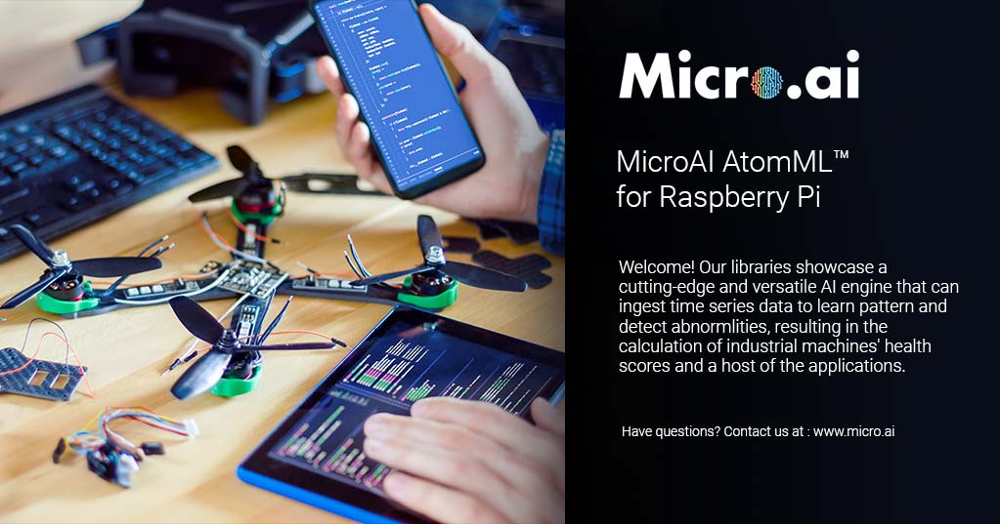

<!-- PROJECT SHIELDS -->
<!--
-->
[![LinkedIn][linkedin-shield]](https://www.linkedin.com/company/27247876)


<!-- PROJECT LOGO -->
<br />
<p align="center">
  <a href="https://github.com/github_username/repo_name">
    
  </a>

  <h3 align="center">MicroAI Atom for the Raspberry Pi</h3>

  <p align="center">
    Access the Table of Contents below to browse through instructions, information about our MicroAI libraries, and more. 
    We hope you enjoy our product launch and are excited to see what you and your teams can create!
    <br />
    


<!-- TABLE OF CONTENTS -->
## Table of Contents

* [About the Project](#about-the-project)
  * [Built With](#built-with)
* [Getting Started](#getting-started)
  * [Prerequisites](#prerequisites)
  * [Installation](#installation)
* [Usage](#usage)
  * [Security](#security)
  * [APM](#apm)
* [Roadmap](#roadmap)
* [License](#license)
* [Contact](#contact)


<!-- ABOUT THE PROJECT -->
## About The Project

![Product Name Screen Shot][product-screenshot]


MicroAi Atom for Raspberry Pi is an MPU based AI that specializes in anomaly detection and one step ahead predictions. 
It takes in time series data as its input and produces acceptable upper and lower bounds for the next input as its output.


### Built With

* [Go-Lang](#Go-Lang)


<!-- GETTING STARTED -->
## Getting Started

Before we begin with MicroAI Atom, we must first make some changes to your raspberry pi to ensure everything runs as intended.

1. Expand space on the pi
    * From a terminal `sudo raspi-config`
    * select `7 Advanced Options`
    * select `A1 Expanding Space`
    * `sudo reboot`
2. Enable Wi-Fi
    * From a terminal `sudo raspi-config`
    * select `2 Network Options`
    * select `N2 Wi-Fi`
    * Enter your Wi-Fi's SSID and password
    * `sudo reboot`
3. Enable SSH (Not Necessary if you prefer to work directly on the Pi)
    * From a terminal `sudo raspi-config`
    * select `5 Interfacing Options`
    * select `P2 SSH` 

### Prerequisites

You will need to run the following commands so that you have the required dependencies for the project.

```sh
sudo apt-get update
sudo apt-get updgrade
sudo apt-get install python3-pip
sudo apt-get install sense-hat
sudo apt-get install redis-server
sudo reboot
pip3 install redis
pip3 install -Iv bottle==0.12.17
pip3 install -Iv tqdm==4.32.1
```
It should be noted that bottle and tqdm are only required for the security project.

### Installation

1. Clone the repo
```sh
git clone https://github.com/ONE-Tech-Inc/MicroAI-Atom-RaspberryPi3.git
```

<!-- USAGE EXAMPLES -->
## Usage


### Security
The Security Project monitors numerous computational performance metrics of the host device.  The specific channels used are kept secret for now.  With this project being a part of the EVK, we have limited the number of channels to 6, but in typical use cases, we monitor many more internal channels.  To demonstrate the Security Use Case, do the following:
1. Ensure your device is in normal operation (all services and programs that are ran in standard operation are activated)
2. Train MicroAI on your devices normal operation
3. Utilize the Attack tool to attack the device

MicroAI should detect the attacks as abnormal behavior, and your application layer (Y-Code) can trigger any user defined reaction

_Click on the image below to view a video tutorial for the project_

[](https://www.youtube.com/watch?v=zvXOJGZerpc)

_For more details, please refer to the project guide PDFs_


### APM
The APM project monitors the movement and measurement of accelerometers and gyroscopes. 
It learns the normal behavior and motion of the sensors, and when that pattern is broken, it triggers an alert defined
on the application layer.  To demonstrate the APM Use Case, do the following:
1. Create a simple movement pattern for the sensors to track and train the device on this pattern (To ensure precision, 
we use a robot to define the movement in the example video, but this process can be done by hand)
2. Train MicroAI Atom on this pattern
3. Execute the MicroAI engine
4. Continue moving in the pattern.  Break pattern to trigger an alert  

_Click on the image below to view a video tutorial for the project_

[](https://www.youtube.com/watch?v=kqWA4BxvDPE)

_For more details, please refer to the project guide PDFs_

<!-- ROADMAP -->
## Roadmap

See the [open issues](https://github.com/ONE-Tech-Inc/MicroAI-Atom-RaspberryPi3/issues) for a list of proposed features (and known issues).


<!-- LICENSE -->
## License

See  [Software Evaluation Licensing Agreement](MicroAI%20Atom%20Evaluation%20License%20Agreement.pdf)  for more information.


<!-- CONTACT -->
## Contact

Company: MicroAI

Website: www.micro.ai

Email: support@micro.ai


<!-- MARKDOWN LINKS & IMAGES -->
<!-- https://www.markdownguide.org/basic-syntax/#reference-style-links -->
[contributors-shield]: https://img.shields.io/github/contributors/ONE-Tech-Inc/repo.svg?style=flat-square
[contributors-url]: https://github.com/ONE-Tech-Inc/repo/graphs/contributors
[forks-shield]: https://img.shields.io/github/forks/ONE-Tech-Inc/repo.svg?style=flat-square
[forks-url]: https://github.com/ONE-Tech-Inc/repo/network/members
[stars-shield]: https://img.shields.io/github/stars/ONE-Tech-Inc/repo.svg?style=flat-square
[stars-url]: https://github.com/ONE-Tech-Inc/repo/stargazers
[issues-shield]: https://img.shields.io/github/issues/ONE-Tech-Inc/repo.svg?style=flat-square
[issues-url]: https://github.com/ONE-Tech-Inc/repo/issues
[license-shield]: https://img.shields.io/github/license/ONE-Tech-Inc/repo.svg?style=flat-square
[license-url]: https://github.com/ONE-Tech-Inc/repo/blob/master/LICENSE.txt
[linkedin-shield]: https://img.shields.io/badge/-LinkedIn-black.svg?style=flat-square&logo=linkedin&colorB=555
[linkedin-url]: https://linkedin.com/in/ONE-Tech-Inc
[product-screenshot]: Images/Overview.png
